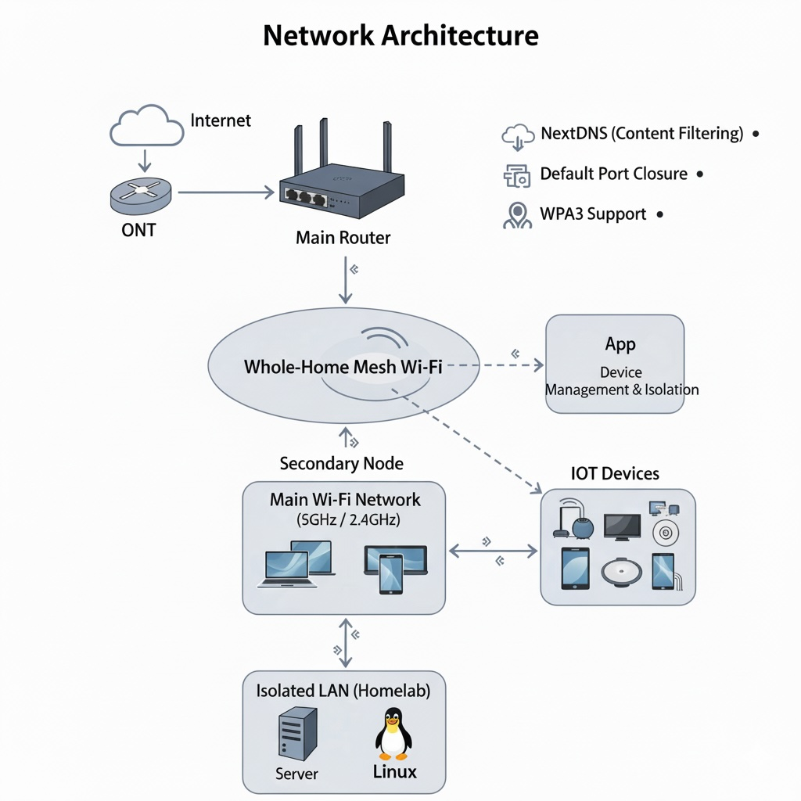

# Network Privacy & Control

*Abr. 2025*

This project's goal was to modernize a residential network infrastructure to improve security, performance, and scalability, moving from a basic provider-supplied setup to an advanced solution with full control.

## Implemented Solution

*   **Advanced Network Configuration:** The provider's router was eliminated. After obtaining the connection credentials from the operator, the PPPoE protocol was configured on a personal router, achieving full management control over the network.

*   **Mesh Network Deployment:** Two state-of-the-art network devices were installed to create a robust mesh network, ensuring optimal coverage throughout the home and overcoming physical barriers.

*   **Proactive Segmentation and Security:** Multiple segmented networks (2.4/5 GHz, an isolated network for IoT) were created to improve security and performance. WPA3 was implemented, ports were closed to reduce the attack surface, and NextDNS was integrated for network-level DNS filtering (blocking ads, trackers, and malicious domains).

*   **Homelab Isolation:** A dedicated and isolated network segment was established for the homelab environment, minimizing the risk of exposure and protecting the main network.

## Project Results

*   **Optimized Performance:** Network performance improved consistently, reaching speeds of 500-600 Mbps and stably supporting multiple users and high-demand services.

*   **Granular Security and Control:** Full control over the network was achieved, with a substantial improvement in security and privacy through network segmentation and advanced DNS filtering.

*   **Scalable Infrastructure:** The new network architecture was designed to allow for future expansion, with the capacity to adapt to new technologies (like Wi-Fi 7) and service needs.
